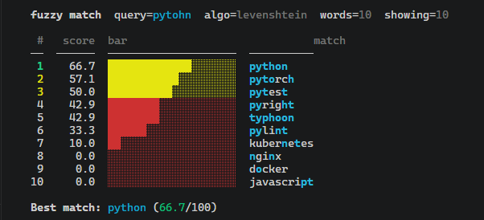

# fuzzy

`fuzzy-match-cli` is a Python CLI tool for finding fuzzy string matches in a word list, CSV file, TSV file, or piped input.

It supports three algorithms:

- Levenshtein similarity
- Jaro similarity
- Jaro-Winkler similarity

The tool is useful for quick local lookups, typo-tolerant search experiments, cleaning CSV data, matching names, and building small developer automation scripts.

## Features

- Reads from a file or `stdin`
- Supports plain text, CSV, and TSV input
- Can select a specific CSV/TSV column
- Supports case-insensitive matching
- Supports pretty terminal output or machine-readable CSV output
- Includes pytest-based test coverage

## Requirements

- Python 3.10+

Runtime dependencies: none.

Development/test dependency:

```bash
python3 -m venv .venv
source .venv/bin/activate
python -m pip install --upgrade pip
python -m pip install -r requirements-dev.txt
```

On Debian/Ubuntu systems with Python 3.12+, installing with plain
`pip install -r requirements-dev.txt` may fail with
`externally-managed-environment`. That is expected for system-managed Python
installations. Use a virtual environment as shown above instead of passing
`--break-system-packages`.

If creating the virtual environment fails, install the standard Python venv
support first:

```bash
sudo apt update
sudo apt install python3-full
```

## Quick start

Clone the repository:

```bash
git clone https://github.com/andrii2g/fuzzy-match-cli.git
cd fuzzy-match-cli
```

Run directly:

```bash
python fuzzy.py "pytohn" words.txt
```



The repository includes `words.txt`, `names.csv`, and `names.tsv` sample files
so the quick-start commands work immediately after cloning.

Or make it executable on Linux/macOS:

```bash
chmod +x fuzzy.py
./fuzzy.py "pytohn" words.txt
```

## Usage

```text
fuzzy.py <query> [options] [wordlist_file]
```

If no file is provided, the tool reads candidates from `stdin`.

### Options

| Option | Description |
|---|---|
| `-n, --top N` | Show top N matches. Default: `10`. Must be greater than `0`. |
| `-t, --threshold N` | Only show matches with score >= N. Range: `0..100`. Default: `0`. |
| `-a, --algo ALGO` | Algorithm: `levenshtein`, `jaro`, or `jaro_winkler`. Default: `levenshtein`. |
| `-c, --col N` | Use column N for CSV/TSV input. 1-based. Default: `1`. |
| `-i, --ignore-case` | Use case-insensitive matching. Uses Unicode-aware `casefold()`. |
| `--csv` | Output results as CSV. |
| `--no-color` | Disable ANSI colors in terminal output. |
| `-h, --help` | Show help. |

## Examples

Search a plain word list:

```bash
python fuzzy.py "pytohn" words.txt
```

Show only the top 5 results using Jaro-Winkler:

```bash
python fuzzy.py "pytohn" words.txt -n 5 -a jaro_winkler
```

Read from `stdin`:

```bash
cat words.txt | python fuzzy.py "ngnix"
```

Search the second column of a CSV file:

```bash
python fuzzy.py "Jon Smith" names.csv -c 2 --threshold 70
```

Generate machine-readable CSV output:

```bash
python fuzzy.py "pytohn" words.txt --csv
```

Case-insensitive matching:

```bash
python fuzzy.py "straße" words.txt -i
```

Disable colors:

```bash
python fuzzy.py "pytohn" words.txt --no-color
```

## Input formats

### Plain text

One candidate per line:

```text
python
pytest
pyright
```

### CSV

```csv
id,name
1,John Smith
2,Jane Doe
```

Search column 2:

```bash
python fuzzy.py "Jon Smith" names.csv -c 2
```

### TSV

```text
id	name
1	John Smith
2	Jane Doe
```

Search column 2:

```bash
python fuzzy.py "Jon Smith" names.tsv -c 2
```

## Algorithms

### Levenshtein

Levenshtein distance counts how many single-character edits are needed to transform one string into another. The tool normalizes this into a `0..100` similarity score.

Best for:

- typo correction
- short command names
- file names
- identifiers

### Jaro

Jaro similarity gives higher scores when matching characters appear in roughly the same order and position.

Best for:

- names
- short labels
- strings with transpositions

### Jaro-Winkler

Jaro-Winkler is based on Jaro and adds a prefix bonus for strings that start similarly.

Best for:

- person names
- product names
- lookup lists where prefixes matter

## Running tests

Create and activate a virtual environment, then install test dependencies:

```bash
python3 -m venv .venv
source .venv/bin/activate
python -m pip install --upgrade pip
python -m pip install -r requirements-dev.txt
```

Run tests:

```bash
python -m pytest
```

The tests include example-level checks that run the sample commands against
`words.txt`, `names.csv`, and `names.tsv`. This catches broken documentation
examples such as missing input files.

Run with verbose output:

```bash
python -m pytest -v
```

## Repository structure

```text
.
├── fuzzy.py
├── README.md
├── assets
│   └── demo.png
├── words.txt
├── names.csv
├── names.tsv
├── requirements-dev.txt
├── pyproject.toml
├── .gitignore
└── tests
    ├── test_algorithms.py
    ├── test_cli.py
    ├── test_examples.py
    └── test_input_loading.py
```

## Design notes

The first version is intentionally simple:

- no server
- no database
- no external fuzzy matching library
- no package publishing workflow
- no configuration file

This keeps the repository easy to read, test, and extend.

## Possible future improvements

- Add `--json` output
- Add `--limit-length` for very large input files
- Add optional rapid matching backend using `rapidfuzz`
- Add `--include-header` / `--skip-header` for CSV workflows
- Add GitHub Actions CI
- Publish as a package with a console script

## License

MIT License. See [LICENSE](LICENSE).
